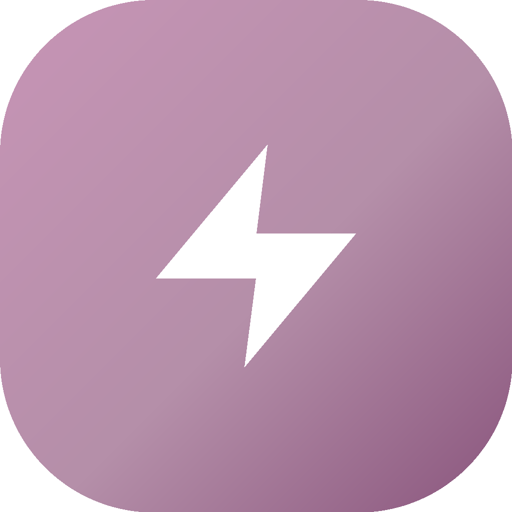
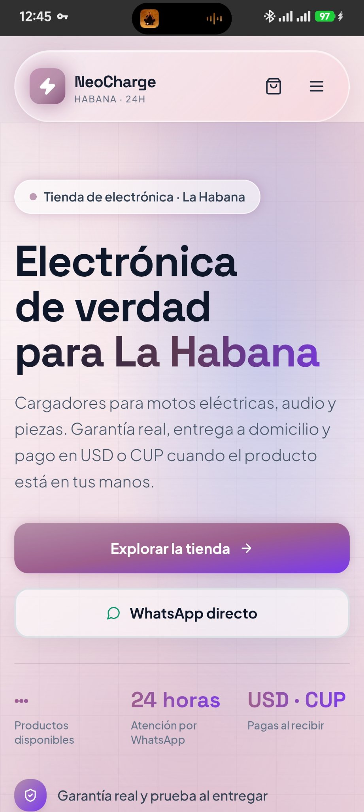
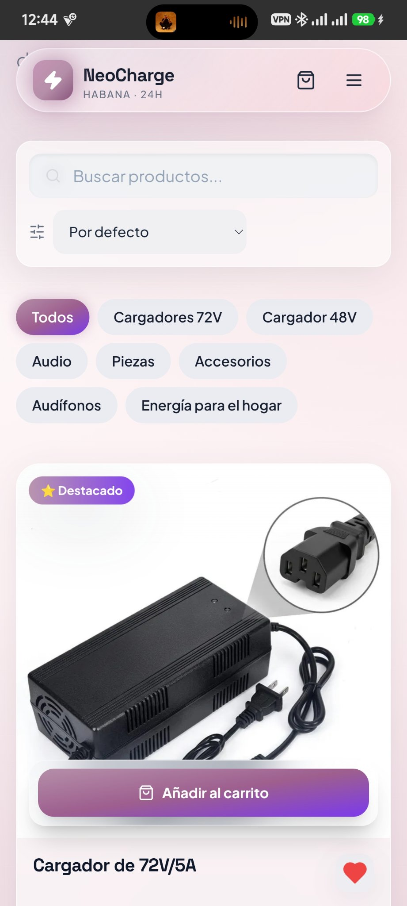
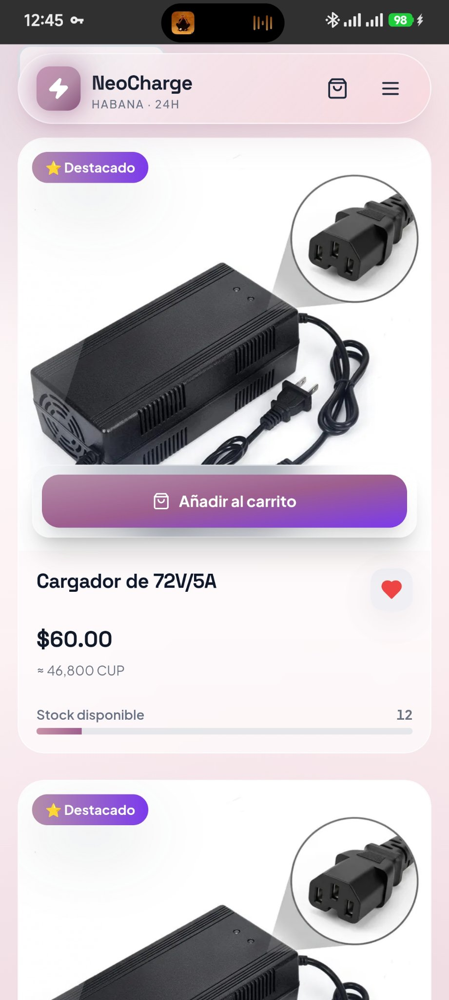

<div align="center">



# NeoCharge

**La tienda de electrónica de La Habana — en la web y en tu bolsillo.**

[](https://tienda-neocharge.vercel.app)
[](https://tienda-neocharge.vercel.app/descargas)
[](https://supabase.com)

Cargadores para motos eléctricas, audio, piezas y accesorios. Garantía real, entrega a domicilio en La Habana y pago en USD o CUP al recibir.

[🌐 Ver la tienda](https://tienda-neocharge.vercel.app) · [📱 Descargar la app Android](https://tienda-neocharge.vercel.app/descargas) · [💬 WhatsApp directo](https://wa.me/5363180910)

</div>

---

## ✨ Qué tiene

| Área | Detalles |
|------|----------|
| 🛒 **Tienda completa** | Catálogo, categorías, buscador, filtros, favoritos, comparador de cargadores |
| 💬 **Checkout por WhatsApp** | El pedido se confirma directo por WhatsApp, pago en efectivo USD/CUP al recibir |
| 📱 **App Android nativa** | APK firmada (v1.0.10), funciona **sin internet**: trae la base de datos empaquetada |
| 📶 **Modo offline** | Productos, categorías, tasa, servicios y blog disponibles sin conexión |
| 👤 **Cuentas** | Registro y login (email + Google), perfil, historial de pedidos |
| 🛠️ **Panel admin** | Dashboard con roles y permisos granulares, caja, mensajería, socios |
| 💱 **Tasa automática** | Precios en CUP actualizados con la tasa USD del día |
| 🎨 **Diseño propio** | Paleta malva (Moon Pink · Dusty Mauve · Night Plum), PWA instalable |

## 📸 Así se ve

<div align="center">

| Inicio | Tienda | Producto |
|:---:|:---:|:---:|
|  |  |  |

</div>

## 🛠️ Stack

**Frontend:** React 18 · TypeScript · Vite · Tailwind CSS · shadcn/ui · React Router · TanStack Query
**Backend:** Supabase (PostgreSQL · Auth · Storage · Realtime)
**Móvil:** Capacitor (APK Android) · PWA con service worker
**Deploy:** Vercel

## 📁 Estructura

```
src/
├── pages/            # Tienda, producto, checkout, cuenta, admin, blog, servicios…
├── components/       # UI reutilizable, secciones, admin, layout
├── hooks/            # use-cart, use-exchange-rate, use-online…
├── lib/              # offline-cache, formateo, utilidades
├── integrations/     # Cliente Supabase (lazy, fuera del bundle inicial)
└── types/            # Tipos TypeScript

supabase/migrations/ # Migraciones SQL
public/
├── descargas/       # APK firmada (enlace permanente de descarga)
└── offline-seed.json # Base de datos empaquetada para modo offline
scripts/
└── export-offline-seed.mjs  # Genera la semilla offline desde Supabase
```

## 🚀 Desarrollo

```bash
git clone https://github.com/MelquiHK/neocharge.git
cd neocharge
npm install
cp .env.example .env        # pon tus credenciales de Supabase
npm run dev                 # http://localhost:8080
```

| Script | Qué hace |
|--------|----------|
| `npm run dev` | Servidor de desarrollo |
| `npm run build` | Build de producción |
| `npm run test` | Tests (Vitest) |
| `npm run lint` | ESLint |
| `node scripts/export-offline-seed.mjs` | Regenera `public/offline-seed.json` |

La **app Android** se compila con el build manual en `../app-android/manual-build/` (Capacitor + apksigner, sin Android Studio).

---

<div align="center">

Hecho con 💜 en La Habana · NeoCharge © 2026

</div>
